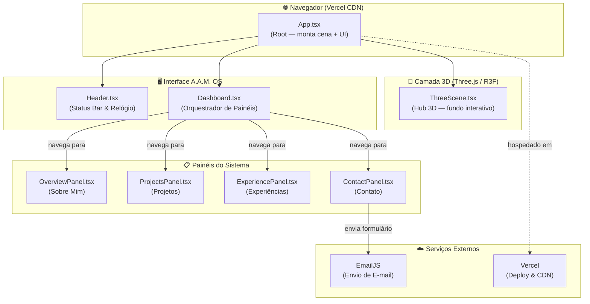

# **Portfólio Profissional - `A.A.M. OS`**

### **[LIVE DEMO ->](https://portfolio-arthur-am.vercel.app/)**


---

## **1. Descrição do Projeto (System Overview)**

Este projeto é uma reinterpretação radical de um portfólio web, concebido como uma **experiência interativa imersiva**. Em vez de um site tradicional, o usuário "acessa" um sistema operacional fictício, o `A.A.M. OS`, apresentado como um dashboard de monitoramento com uma estética cyberpunk.

O objetivo é apresentar minha trajetória, habilidades e projetos de uma forma que não apenas informa, mas também demonstra proficiência técnica e criatividade, utilizando um hub 3D interativo como plano de fundo e uma UI reativa para navegação.

## **2. Pilha de Tecnologias (Core Stack)**

A arquitetura do `A.A.M. OS` foi construída com as seguintes tecnologias:

#### **Front-end & UI**


#### **3D & Animação**


#### **Backend (Formulário de Contato)**


#### **Cloud & DevOps (Hospedagem)**


---
*A lista completa de tecnologias que domino, com base na minha experiência profissional, inclui:*

#### **Linguagens & Front-end**


#### **Cloud, Containers & DevOps**


**Serviços de Computação, Armazenamento & Segurança AWS:** <br/>


#### **Bancos de Dados & Observabilidade**


---

## **3. Arquitetura do Sistema (System Architecture)**

O `A.A.M. OS` é uma SPA (Single Page Application) onde o `Dashboard.tsx` orquestra a navegação entre painéis. A cena 3D roda em paralelo como plano de fundo independente via React Three Fiber.



---

## **4. Estrutura de Diretórios (Project Structure)**

```text
portfolio-aam-os/
├── public/                  # Assets estáticos
├── src/
│   ├── assets/              # Assets internos
│   │   ├── images/          # Imagens usadas no Frontend
│   ├── components/          # Componentes React reutilizáveis
│   │   ├── ThreeScene.tsx   # Renderização da cena 3D de fundo
│   │   ├── Header.tsx       # Cabeçalho da UI
│   │   ├── Dashboard.tsx    # Orquestrador da navegação e conteúdo
│   │   ├── OverviewPanel.tsx  # Seção "Sobre Mim"
│   │   ├── ProjectsPanel.tsx  # Seção "Projetos"
│   │   ├── ExperiencePanel.tsx# Seção "Experiências"
│   │   └── ContactPanel.tsx   # Seção "Contato" com formulário
│   ├── App.tsx              # Componente raiz da aplicação
│   ├── main.tsx             # Ponto de entrada da aplicação
│   └── index.css            # Estilos globais e diretivas do Tailwind
├── .gitignore
├── package.json
├── tailwind.config.js
└── README.md
```

## **5. Execução Local (Local Deployment)**

Para clonar e rodar este projeto em seu ambiente local, siga os passos abaixo.

**Pré-requisitos:**
*   Node.js (v18 ou superior)
*   npm ou yarn

**Passo 1: Clone o repositório**
```bash
git clone https://github.com/arthur-amx/portfolio-arthur-am.git
cd portfolio-aam-os
```

**Passo 2: Instale as dependências**
```bash
npm install
```

**Passo 3: Configure as variáveis de ambiente (para o formulário)**

Crie um arquivo chamado `.env` na raiz do projeto e adicione suas chaves do EmailJS:

```bash
VITE_EMAILJS_SERVICE_ID=SEU_SERVICE_ID
VITE_EMAILJS_TEMPLATE_ID=SEU_TEMPLATE_ID
VITE_EMAILJS_PUBLIC_KEY=SUA_PUBLIC_KEY
```

**Passo 4: Rode o servidor de desenvolvimento**
```bash
npm run dev
```
O sistema estará disponível em `http://localhost:5173`.
